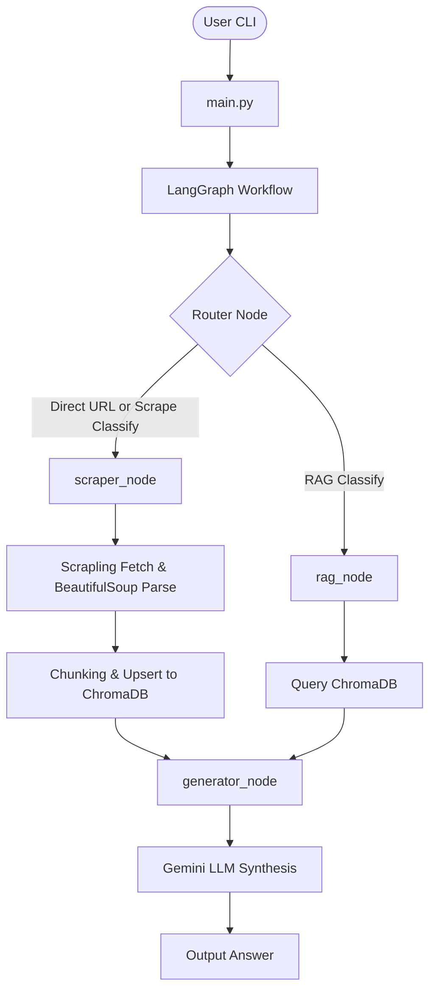

# RAG-Scrape

A Retrieval-Augmented Generation (RAG) and forum scraping pipeline orchestrated with LangGraph, designed to systematically extract valuable and hidden knowledge from community forums.

---

## 1. Why I Built It

There is a wealth of region-specific, highly localized, and hidden knowledge buried deep inside local community forums (like Voz).
Finding this information manually is time-consuming, as threads can span dozens of pages filled with spam, noise, and off-topic discussions.
I built this tool to systematically scrape, chunk, index, and query forum discussions.
It enables users to extract valuable technical insights and local community sentiments instantly and systematically, saving hours of manual reading.

---

## 2. System Architecture

The application uses a hybrid agentic flow built on LangGraph:



### Key Technical Decisions
* **LangGraph Control Flow:** Orchestrates state transitions between scraping, database retrieval, and answer generation.
* **ChromaDB Storage Layer:** Swaps dynamically between a local in-process DB (`PersistentClient`) and a standalone server container (`HttpClient`) depending on environment variables.
* **Google-Bypass Search Scraper:** Uses Google search (`site:voz.vn`) with Scrapling `StealthyFetcher` to find relevant threads. This bypasses XenForo's strict guest search rate-limits and Cloudflare blocks.
* **Structured Logging & Tracing:** Outputs logs as single-line JSON (`LOG_FORMAT=json`) in production, with dependency log levels optimized, and integrates full execution tracing via Langfuse.

---

## 3. Getting Started

### Local Installation
1. Ensure you have Python 3.12+ and [uv](https://github.com/astral-sh/uv) installed.
2. Clone the repository and install all dependencies:
   ```bash
   uv sync --all-extras --dev
   ```
3. Copy the `.env.example` file to `.env` and fill in your Gemini API key:
   ```bash
   cp .env.example .env
   ```

### Docker Setup
You can run the entire system, including a standalone ChromaDB server, using Docker Compose:
1. Copy `.env.example` to `.env` and configure your API keys.
2. Build and start the services:
   ```bash
   docker compose up -d
   ```

---

## 4. CLI Operation and Commands

The tool exposes three CLI subcommands.

### Command 1: Search and Auto-Index
Search for relevant Voz threads by keyword.
The system will display matching threads and automatically scrape and index the top search result into ChromaDB:
```bash
# Local Execution
uv run python main.py search "python"

# Docker Execution
docker compose run --rm app search "python"
```

### Command 2: Ask Questions
Ask a question.
The router will determine whether to fetch information from local indexed history (RAG) or fetch a new forum thread:
```bash
# Ask using existing database history
uv run python main.py ask "Mọi người khuyên học Python ở đâu?"

# Force scrape a specific thread and answer based on it
uv run python main.py ask "Tóm tắt thớt này giúp tôi" --url "https://voz.vn/t/hanh-trinh-tu-hoc-python-100-ngay.1178261/"
```

### Command 3: Reset Vector Database
Clear all indexed threads and reset the ChromaDB database collection:
```bash
uv run python main.py --reset-db
```
